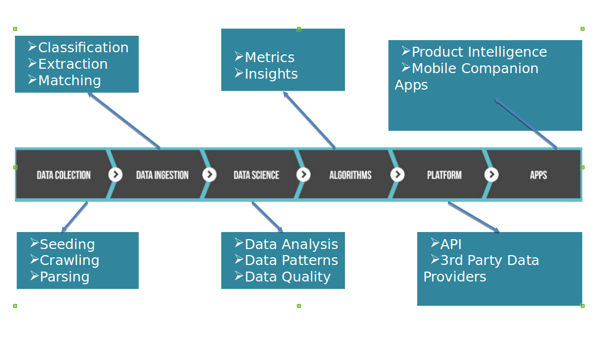
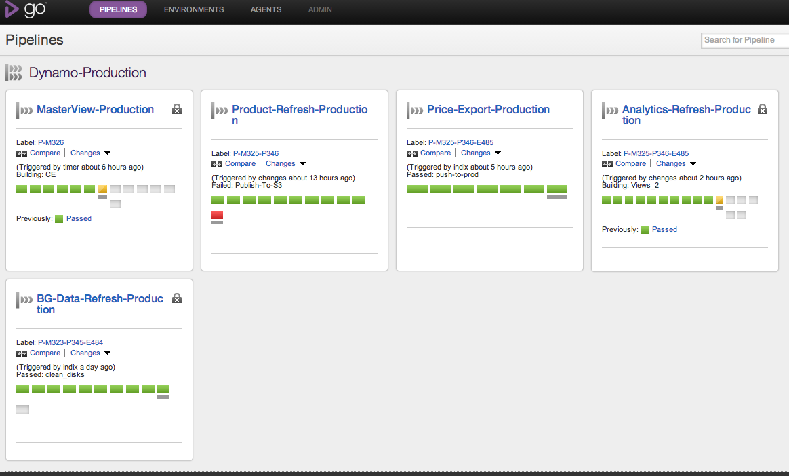

---

layout: ribbon

style: |

    #Cover h2 {
        margin:10px 0 0;
        color:#FFF;
        text-align:center;
        font-size:60px;
        }
    #Cover p {
        margin:250px 0 0;
        text-align:center;
        color:#FFF;
        font-style:italic;
        font-size:30px;
          }
        #Cover p a {
            color:#FFF;
            }
    #Picture h2 {
        color:#FFF;
        }
    #SeeMore h2 {
        font-size:100px
        }
    #SeeMore img {
        width:0.72em;
        height:0.72em;
        }
    #Pipeline img {
       width:30em;
       margin:-30px -10px 0 0; 
       height:20em;    
       }
    #goPipelines img {
       width:30em;
       margin:-30px -10px 0 0; 
       height:20em;    
       }   
    
---

# Analytics on Large Scale, Unstructured Data using Lambda Architecture {#Cover}

*[Rajesh Muppalla](http://www.github.com/codingnirvana/) - rajesh@indix.com*

<!-- photo by John Carey, fiftyfootshadows.net -->

## About Me

- Co-Founder @ `Indix`
	- ... Data Platform Lead
	- ... Focus Areas
		- ... Big Data
		- ... Distributed Systems
- ... Ex-Thoughtworks
	- ... Tech Lead on `Go-CD`
    - ... An open source agile release management tool

## About Indix

- Product Intelligence Platform
- ...Founded - Jan 2012
- ...50 Person team in Chennai & Seattle
- ...Big Data Company 
	- ...350 M Products
	- ...10 B Prices
	- ...4 TB data crawled daily

## Data Pipeline @ Indix {#Pipeline}

## Implementation - First Attempt

- Storage - Mongo DB
  - ...Convenient
  - ...Schema-less
  - ...Used it likes an RDMBS
- ...Analytics
  - ...No batch processing
  - ...All queries real time  
- ...In Production for 4 Months

## Implementation - Second Attempt

- HBase
  - ...Data Model based on Google's Big Table
    - ...One Single Table
    - ...Different CF for each component
  - ...JSON for Serialization
- ...Map Reduce Jobs
  - ...Java API
- ...In Production for 1 year  

## Pain Points
  
  - Data Corruption
    - ... Data Model evolution error prone
    - ... Trivial bugs had cascading effect
  - ... Operational Issues
    - ... High Write/Read Througput not sustainable
    - ... Rolling out updates needed downtime
  - ... Long Running Jobs

## **Rethink our Data Platform** {#SeeMore}

## Requirements

- Human Fault Tolerant
- ... Storage
  - ... Immutable
  - ... High Read/Write Throughput
  - ... Operationally Easy
- ... Recomputation
  - ... Newer Facts Discovered

## Requirements (Continued)

- Processing
  - ... Higher Level (Abstractions)
- ... Latency
  - ... Near Real Time (Few Hours)

## Lambda Architecture

<!--photo source - http://lambda-architecture.net/ -->

## Lambda Architecture @ Indix

- TODO - Add Diagram

## Batch Layer - Data Model

- Store Raw(est) Data
  - ... Human Fault Tolerant
  - ... Capturing change with Immutability
    - ... Fact based model
- ... Enforceable Schema
  - ... Thrift for Serialization
  - ... Schema Evolution

## Batch Layer - Data Model

  - TODO - Fact Based Model examples
  - TODO - Schema Evolution examples

## Batch Layer - Data Storage

- ... Directories in HDFS
  - ... Vertical Partioning Scheme
  - ... Pail as an Abstraction Layer
- ... HDFS Small Files Problem
  - ... Archival & Consolidation

## Batch Layer - Data Storage

- TODO - Pail Code Snippets
- TODO - Archival & Consolidation Template

## Batch Layer - Processing

- Map Reduce
  - ... Linear Scalability
- ... Scalding
  - ... Higher Level Abstractions
  - ... Write Complex Map Reduce Jobs
- ... Spark
  - ... For Iterative Algorithms
  - ... E.g. Clustering 

## Batch Layer - Tying it all together {#goPipelines}

## Serving Layer
  - Views and Indexes on Batch Data
  - ... HBase & Solr
    - ... Bulk Import batch data
    - ... No random writes
    - ... Multiple Tables/Collections, optimized according to queries

## Speed Layer - Real Time Views
  - Responsible for low latency updates
  - ... Transient
    - ... Low State 
  - ... Incremental Computation
    - ... Tradeoff - Latency vs Eventual Accuracy
    - ... Apporximations may work
  
## Speed Layer - Algorithms & Data Structures
  - ... Abstract Algebra Concepts
    - ... Monoids
  - ... Data Structures  
    - ... BloomFilters
    - ... HyperLogLog
    - ... Count Min Sketch    

## Speed Layer - Architecture
  - Micro Batch Processing
  - ... HBase and Solr
    - ... Random writes
  - ... Expiring Real Time Views

## Query Layer
  - Responsible for answering queries
    - ... Merges Serving Layer + Speed Layer
  - ... TODO - Diagram of merging 

## Open Problems
  
  - Batch & Real Time Code Duplication 
    - ... Evaluating Summingbird
  - ... Reducing Latency to minutes
    - ... Evaluating Kafka + Storm and Spark streaming
  
## Summary
  
  - Lambda Architecture
    - ... Blueprint to build batch and real time systems
    - ... Domain agnostic but have to adapt to your domain
    - ... Solid Principles but Tools & Technologies not mature yet

## Resources

- [Runaway Complexity in Big Data Systems](http://www.slideshare.net/nathanmarz/runaway-complexity-in-big-data-and-a-plan-to-stop-it)
- [Lambda Architecture](http://lambda-architecture.net/)
- [Big Data Book - Manning](http://www.manning.com/marz/)
- [Scalding](https://github.com/twitter/scalding)
- [Spark](http://spark.apache.org/)
- [Pail](https://github.com/nathanmarz/dfs-datastores)
- [Summingbird](https://github.com/twitter/summingbird)

## **Questions**

## **Thanks**

