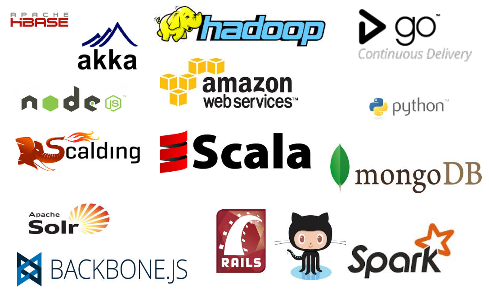
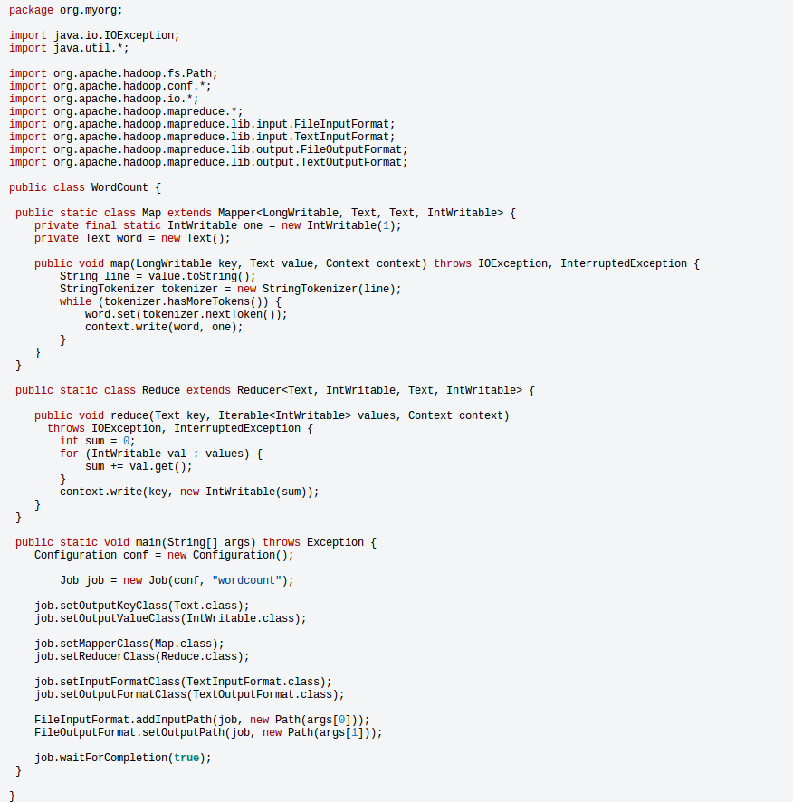
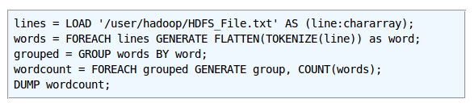

---

layout: ribbon

style: |

    #Cover h2 {
        margin:30px 0 0;
        color:#FFF;
        text-align:center;
        font-size:70px;
        }
    #Cover p {
        margin:250px 0 0;
        text-align:center;
        color:#FFF;
        font-style:italic;
        font-size:30px;
        }
        #Cover p a {
            color:#FFF;
            }
    #Picture h2 {
        color:#FFF;
        }
    #SeeMore h2 {
        font-size:100px
        }
    #SeeMore img {
        width:0.72em;
        height:0.72em;
        }
    #DataCollection h2 {
        font-size:80px
        }
    #Akka img {
        width:25em;
        height:17em; 
        }
    #Actor img {
        width:17em;
        height:17em; 
        }
    #Pipeline img {
       width:30em;
       margin:-30px -10px 0 0; 
       height:20em;    
       }
    #TechStack img {
       width:30em;
       height:18em;    
      }
     #MR img {
       width:30em;
       margin:-30px -10px 0 0;
       height:18em;    
      }
      #JWC img {
       width:24em;
       margin:-20px -10px 0 0;
       height:19em;    
      }
      #SWC img {
       width:30em;
       height:12em;    
      }
      #PWC img {
       width:30em;
       height:10em;    
      }
      #FOO img {
       width:30em;
       height:18em;    
      }

    #AkkaSurvey img {
       width:30em;
       margin:-20px -10px 0 0; 
       height:17em;    	  		
      }
---

# Scaling your Data Platform using Scala {#Cover}

*[Rajesh Muppalla](http://www.github.com/codingnirvana/) - rajesh@indix.com*

<!-- photo by John Carey, fiftyfootshadows.net -->

## About Me

- Co-Founder @ `Indix`
	- ...Data Platform Lead
	- ...Focus Areas
		- ... Big Data
		- ... Distributed Systems
- ...Ex-Thoughtworks
	- ...Worked on `Go` - A continuous delivery product

## About Indix

- Product Intelligence Platform
- ...Founded - Jan 2012
- ...50 Person team in Chennai & Seattle
- ...Big Data Company 
- ...Some Stats
	- ...250 M Products
	- ...10 B Prices
	- ...3 TB data crawled daily

## Tech Stack @ Indix {#TechStack}

## Data Pipeline @ Indix {#Pipeline}

## Scala @ Indix

- ... Primary Language for Data Platform & Analytics team
- ... Data Collection (Crawling) 
	- ... Akka
- ... Data Processing
	- ... Scalding
	- ... Spark
- ... Metrics & Dashboard
	- ... Play

## **Data Collection (Crawling)** {#DataCollection}

## Crawler - Requirements

- ...Distributed
- ...Polite
- ...Focused
- ...Efficient
- ...Fault Tolerant
- ...Extensible

## Our Options

-  Existing Open Source
	- ... Nutch, Heritrix
-  ... Build Your Own
	- ... Work Distribution
	- ... Cluster Management
	- ... Storage
	- ... Algorithms

## Our Choice - Akka {#Akka}

## Why Akka?

- Simpler
	- ... Concurrency
		- ... Program at a higher level
		- ... Don`t think 
			- ... threads, shared state
	- ... Scalability
		- ... Distributed by Design
	- ... Fault Tolerance

## **So what`s the  secret sauce?** {#SeeMore}

## **Actors**

## What is an Actor?

- ... Unit of computation in Akka
- ... Message passing concurrency
- ... Purely reactive
	- ... a mailbox
	- ... behavior & state
	- ... scheduled to run when sent a message
- ... Used since 1973
	- ... in Telecom with 9 nines availability

## With a Diagram {#Actor}
 

## **Show me the code**

## **Hello World**

## Parallelism

- ... Scale by creating multiple actor instances
- ... Order is not guaranteed

## Supervision

- ... Manage other Actor''s failure
- ... Termination messages sent to Supervisor
- ... Separates processing & error handling
- ... Multiple Strategies
	- ... One-For-One
	- ... All-For-One

## Clustering

- ... Released in Akka 2.2
- ... Gossip based Cluster Membership
- ... Failure Detector
- ... Cluster DeathWatch
- ... Adaptive Load Balancing

## **Back to the Crawler** 

## Key Components

- ... URL Frontiers 
	- ... Site Queues
	- ... Priority Queues
- ... URL Router ( 1 per frontier)
- ... Http Fetchers	
- ... URL Scheduler

## Patterns Used

- ... Supervision Strategy
- ... Work Pulling
- ... Throttling
- ... Periodic Message Scheduling

## Lessons Learned

- ... The Actor Model
	- ... Like OO - New way of thinking
	- ... Actor composition
	- ... Message design
	- ... Externalize business logic
- ... No Blocking
	- ... Degraded performance due to starvation
	- ... Separate thread pool

## Lessons Learned (Continued)

- ... Running on EC2
	- ... Unreliable Network
	- ... Failure detector tuning

- ... Message Tracing - Debugging
	- ... Unique identifier for all messages
	- ... Splunk to visualize the flow

## Future Akka Roadmap

- ... Persistence
	- ... Jouraling system
	- ... Replay messages on failure
- ... Cluster
	- ... Optimization (for > 200 nodes)
	- ... Re-joining Unreachable Members

## **Data Processing**

## Map Reduce {#MR}

## First Attempt - Java {#JWC}

## Second Attempt - PIG {#PWC}

## Third Attempt - Scalding {#SWC}

## Scalding Model

- ... Built on top of Cascading
- ... Source and Sinks
	- ... Read and write data
	- ... From HDFS, DBs, Memcache etc.
- ... Pipes represents the flows of data in the job

## Why Scala?

- ... Features to implement a DSL 
- ... Map/Reduce is within the functional paradigm
- ... Collection api covers all use cases
	- ... API is very Scala like

## Where do we use Scalding?

- ... Daily Batch Jobs
	- ... Latest products and prices to production
- ... About 100 jobs run daily

## Go Pipeline

## **Real Examples**

## Problems

- ...Not Iterative
- ...Real Time processing

## **Spark**

## What is Apache Spark?

- ... In-memory analytics engine
- ... Compatible with Hadoop Storage APIs
- ... Upto 40x faster than Hadoop
	- ... For memory intensive operations

## Resources

- [Akka Documentation](http://akka.io/docs)
- [LetItCrash Blog](http://www.letitcrash.com)
- Coursera Course - Reactive Programming 

## **Questions**

## **Thanks**

## Extras

- ... Map Reduce Example
- ... Cluster - Advanced 
	- ... Gossip Convergence 
	- ... Leader Election

