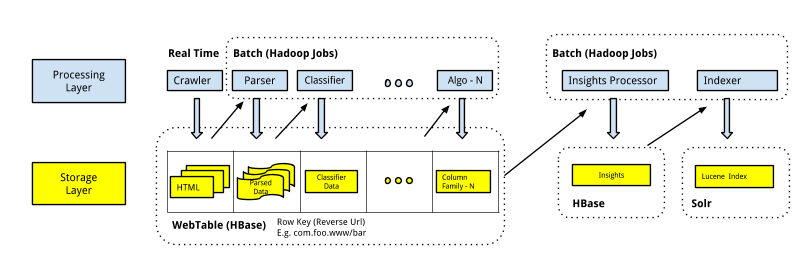

---

layout: ribbon

style: |

    #Cover h2 {
        margin:10px 0 0;
        color:#FFF;
        text-align:center;
        font-size:60px;
        }
    #Cover p {
        margin:250px 0 0;
        text-align:center;
        color:#FFF;
        font-style:italic;
        font-size:30px;
          }
        #Cover p a {
            color:#FFF;
            }
    #Picture h2 {
        color:#FFF;
        }
    #SeeMore h2 {
        font-size:100px
        }
    #SeeMore img {
        width:0.72em;
        height:0.72em;
        }
    #Pipeline img {
       width:30em;
       margin:-30px -10px 0 0; 
       height:20em;    
       }
    #lambda-arch img {
       width:30em;
       margin:-40px -10px 0 0; 
       height:20em;    
       }  
    #bulk-loading img {
       width:33em;
       margin:-30px -10px 0 0; 
       height:17em;    
       }  
    #bulk-loading-timing img {
       width:35em;
       margin:-30px -10px 0 0; 
       height:16em;    
       }  
    #scalding img {
       width:35em;
       margin:-30px -10px 0 0; 
       height:16em;    
       }        
    #goPipelines img {
       width:30em;
       margin:-30px -10px 0 0; 
       height:20em;    
       }   
    
---

# Analytics on Large Scale, Unstructured Data using Lambda Architecture {#Cover}

*[Rajesh Muppalla](http://www.github.com/codingnirvana/) - rajesh@indix.com*

## About Me

- Co-Founder @ `Indix`
  - ... Data Platform Lead
  - ... Focus Areas
    - ... Big Data
    - ... Distributed Systems
- ... Ex-Thoughtworks
  - ... Tech Lead on `Go-CD`
    - ... An open source agile release management tool

## About Indix

- Product Intelligence Platform
- ...Founded - Jan 2012
- ...50 Person team in Chennai & Seattle
- ...Big Data Company 
  - ...350 M Products
  - ...10 B Prices
  - ...4 TB data crawled daily

## Data Pipeline @ Indix {#Pipeline}

## v1.0 Architecture {#arch1}

## Pain Points
  
  - Operational Issues
    - ... HBase Compactions
    - ... No Predictable Performance
    - ... Rolling out updates needed downtime
  - ... Data Corruption
    - ... Trivial bugs had cascading effect
    - ... Traceability was Hard
  
## Pain Points (Contd)

  - Data Loss
    - ... GSON Libray Bug
  - ... MapReduce Abstractions
    - ... Java MapReduce API
      - ... Hard to build complex workflows 
    - ... PIG
      - ... Good for ad-hoc querying
      - ... UDFs are Painful   
      - ... Not for production pipelines

## **Rethink our Data Platform** {#SeeMore}

## **Lambda Architecture**

## Lambda Architecture
  - Approach to building Big Data Systems
    - ... Domain Agnostic - General Purpose
    - ... Batch & Real-Time systems together
    - ... Architecture Components & Principles  
  - ... Coined by Nathan Marz
    - ... Ex-Twitter Engineer
    - ... Creator of Storm
  
## Lambda Architecture {#lambda-arch}

## Key Principles (Contd)    
  
  - Human Fault Tolerant  
    - ... Immutability
      - ... CR instead of CRUD
      - ... "Append" only datasets
      - ... Store "Rawest" form of data
    - ... When there are bugs
      - ... Remove and/or Recompute
 
## Key Principles
  
  - Complexity Isolation
    - ... No Random Write Databases
      - ... In Batch & Serving Layer
      - ... Avoids Major Compactions
    - ... Isolated in Speed Layer
        - ... Much lesser data

## Key Principles (Contd)
  
  - Enforceable Schemas
    - ... Write Time vs Read Time
    - ... Use Data Serialization F/W
      - ... Eg. Thrift, Protobuf, Avro
  - ... Higher Level Abstractions
    - ... MapReduce is to too low level
    - ... Eg. Cascading, Scalding, Cascalog

## Lambda Architecture is not new

  - Search Engines
    - ... Batch Indexing 
    - ... Real Time Indexing (News etc.)
  - ... CQRS
    - ... Different Models - Update and Read
  - ... Event Sourcing
    - ... Application State - series of events
    - ... Replay events to reconstruct past states    

## **Batch Layer**

## Batch Layer
  - Computes arbitrary functions on master data
  - Two key Components
    - ... Compute (or Processing) 
    - ... Storage
  - ... Requirements
    - ... Scalable & Fault Tolerant
    - ... Generic
  
## Batch Layer @ Indix - Compute

- Map Reduce
  - ... Linear Scalability
  - ... Scalding
      - ... Built on top of Cascading
      - ... Use Scala's Higher Order Functions (HOF)
      - ... Concise and Composable 
- ... Some Numbers
  - ... 120+ daily jobs on 100+ node AWS Cluster      

## Scalding - Motivating Example  {#scalding}
  

## Batch Layer @ Indix - Data Storage

- HDFS Directories
  - ... Immutable "Master Data" Store
  - ... Vertical Partioning Scheme
    - ... Hourly/Daily/Weekly 
    - ... Run computes on subset of data
- ... New data
  - ... Appended to the appropriate directory

## HDFS Small File Problem

- HDFS is tuned for large files
  - ... 64 MB default block size
  - ... Small files are a problem
  - ... Eg. Crawlers (50K Compresssed)
- ... Two Problems
  - ... Namenode Memory
    - ... 3 GB / 10 M files
  - ... Number of Mappers
    - ... Extra bookkeeping overhead

## HDFS Small File Problem

- Pail Consolidator
  - ... Consolidates multiple small files
- ... Other Options
  - ... File Crusher
  - ... S3 Distcp
- ... Pail for vertical partitioning  

## **Serving Layer**
 
## Serving Layer  
  
  - Exposes batch views for ad-hoc querying
  - ... Requirements
    - ... Scalable & Fault Tolerant
    - ... Random Reads
  - ... Most Importantly  
    - ... No Random Writes
    - ... Support Bulk Updates
  - ... Database Choices 
    - ... ElephantDB, Splout SQL 

## Serving Layer @ Indix
  
  - HBase and Solr
    - ... Bulk Import batch views
    - ... Indexing Strategy
      - ... Optimized for the queries
    - ... Multiple Tables/Collections
      - ... Swapped when a new batch view is available   

## Example - HBase Bulk Loading {#bulk-loading}

   

## Example - HBase Bulk Loading {#bulk-loading-timing}

## **Speed Layer**

## Speed Layer

- Why?
  - ... Batch views are out of date
  - ... Compensates for high latency of batch layer
- ... For latency updates
  - ... Ingests all new data after the last batch layer run
- ... Complexity Isolation
  - ... Random writes but trasient
  - ... Discarded after next batch run available

## Speed Layer
  - Tradeoffs
    - ... Latency vs Accuracy
    - ... Use appromixation algorithms
    - ... Examples
      - ... HyperLogLog
      - ... BloomFilter
      - ... Count-min Sketch
    
## Speed Layer @ Indix
  
  - Work in Progress
  - ... Micro Batch Implemenation
    - ... Incremental Batch & Serving Layer

## Tying it all together {#goPipelines}

## Open Challenges 
  
  - Reducing Latency to minutes
  - ... Batch & Real Time Code Duplication
  - ... Evaluating Two Broad Approaches
    - ... Abstraction over batch and realtime
      - ... Twitter Summingbird
    - ... Unified Stack for both Batch & Stream Processing
      - ... Spark Streaming
      - ... Kafka + Storm 
      - ... Google Cloud Dataflow
    
## Summary
  
  - Lambda Architecture
    - Blueprint to build batch and real time systems
    - ... Domain agnostic but have to adapt to your domain
    - ... Solid Principles but Tools & Technologies not mature yet

## Resources

- [Runaway Complexity in Big Data Systems](http://www.slideshare.net/nathanmarz/runaway-complexity-in-big-data-and-a-plan-to-stop-it)
- [Lambda Architecture](http://lambda-architecture.net/)
- [Big Data Book - Manning](http://www.manning.com/marz/)
- [Scalding](https://github.com/twitter/scalding)
- [Spark](http://spark.apache.org/)
- [Pail](https://github.com/nathanmarz/dfs-datastores)
- [Summingbird](https://github.com/twitter/summingbird)

## **Questions**

## **Thanks**

## **Alternate Pitch**

